# QHSE AI Platform 🛡️

> Plateforme SaaS intelligente de gestion QHSE propulsée par Azure OpenAI, Microsoft Azure et .NET 8.

---

# 📋 Présentation du projet

QHSE AI Platform est une plateforme SaaS moderne dédiée à la gestion :

- Qualité
- Hygiène
- Sécurité
- Environnement

Le projet combine une architecture Cloud Native basée sur Microsoft Azure avec l’intelligence artificielle Azure OpenAI afin d’automatiser l’analyse des incidents, des audits, des risques et des non-conformités.

---

# 🎯 Objectifs du projet

- Construire une architecture Cloud moderne sur Azure
- Intégrer Azure OpenAI dans une application métier réelle
- Automatiser l’analyse des incidents QHSE
- Déployer une application complète Frontend + Backend
- Mettre en place CI/CD avec GitHub Actions
- Utiliser Terraform comme Infrastructure as Code

---

# 🖥️ Interface utilisateur de la plateforme

L’application dispose d’une interface moderne permettant la gestion des incidents, audits, risques et analyses IA.

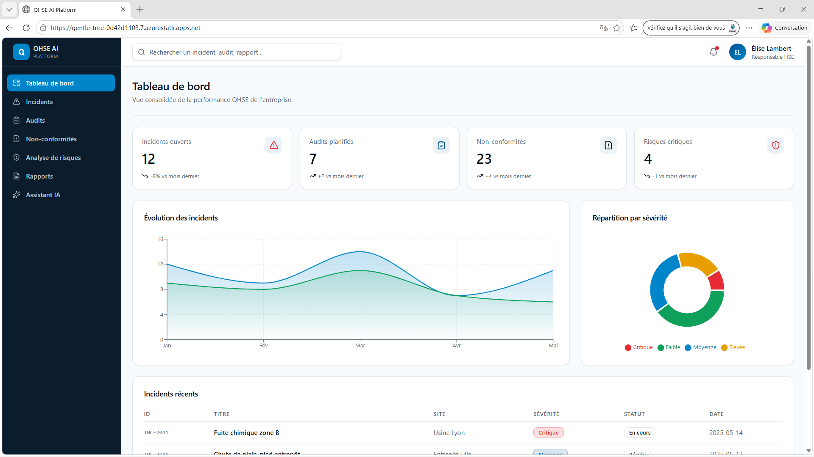

---

# 🤖 Assistant IA QHSE

L’assistant IA permet :

- L’analyse intelligente des incidents
- La classification automatique des risques
- La génération d’actions correctives
- La génération de recommandations préventives

### Exemple d’analyse IA

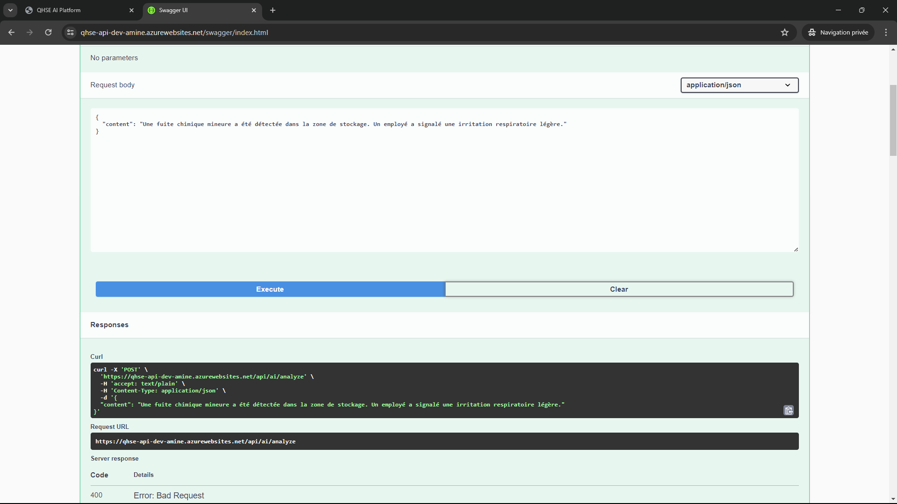

---

# 🧠 Azure OpenAI Integration

Le projet utilise Azure OpenAI avec le modèle GPT-4o-mini déployé sur Azure AI Foundry.

### Déploiement Azure OpenAI

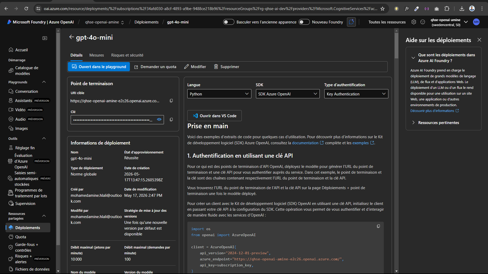

---

# 🏗️ Architecture technique

## Frontend

- React
- TypeScript
- Vite
- Azure Static Web Apps

## Backend

- ASP.NET Core Web API (.NET 8)
- Swagger / OpenAPI
- Entity Framework Core
- Dependency Injection
- Repository Pattern

## Cloud & Infrastructure

- Microsoft Azure
- Azure App Service
- Azure Static Web Apps
- Azure OpenAI
- Azure SQL Database
- Terraform
- GitHub Actions

---

# 📂 Structure du projet

Le projet est organisé en plusieurs couches afin de respecter une architecture propre et scalable.

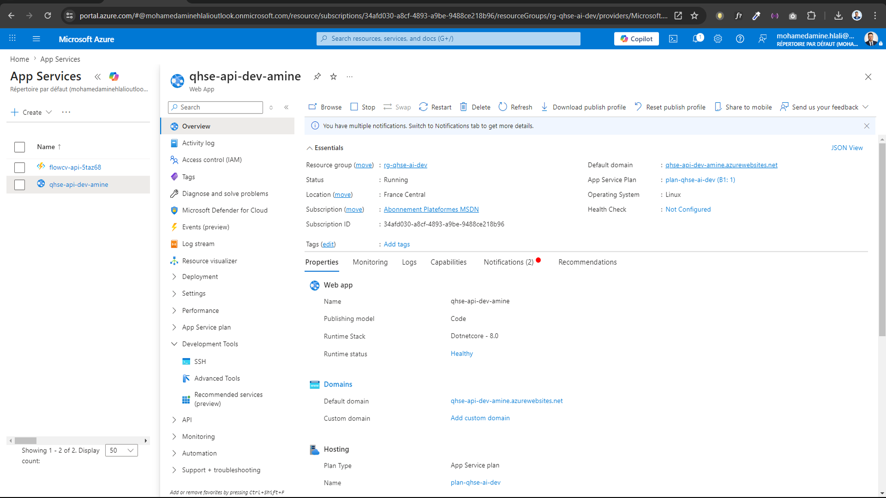

---

# ☁️ Infrastructure as Code avec Terraform

L’infrastructure Azure a été provisionnée automatiquement avec Terraform.

### Terraform Apply

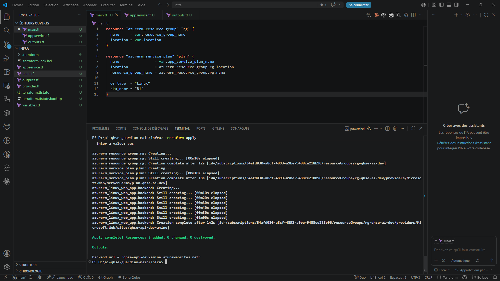

### Ressources créées

- Azure Resource Group
- Azure App Service Plan
- Azure Linux Web App

---

# ⚙️ Build et publication du Backend

Le backend .NET 8 est compilé puis publié avant le déploiement sur Azure App Service.

### Dotnet Publish

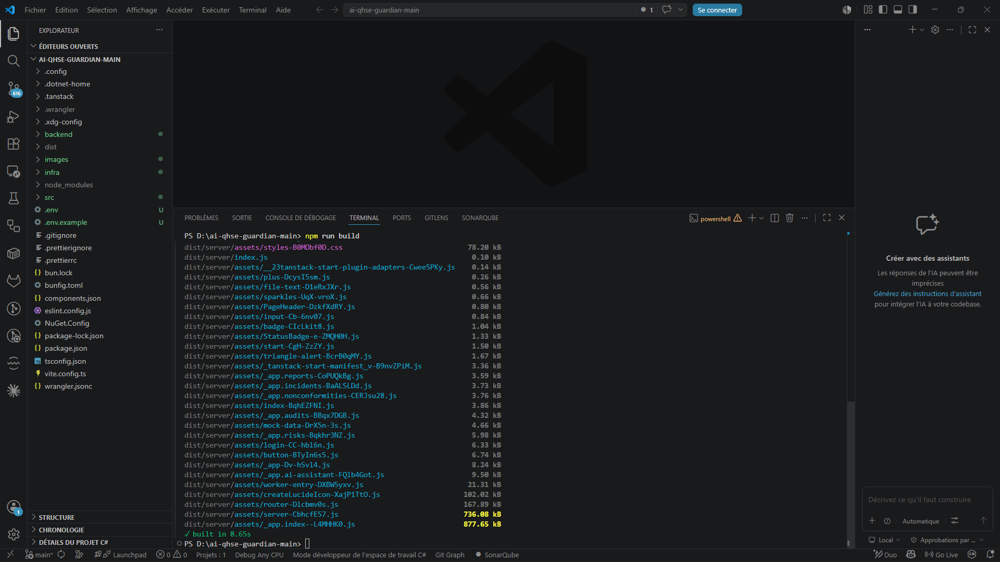

---

# 🚀 Déploiement Azure App Service

Le backend API est hébergé sur Azure App Service Linux.

### Azure App Service

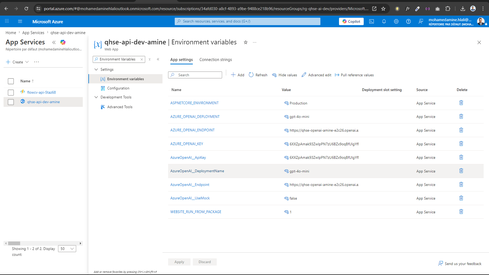

---

# 🔍 Debugging et monitoring avec Kudu

Le projet utilise le portail Kudu pour le debugging, les logs et les vérifications runtime.

---

# 🌐 Déploiement Frontend Azure Static Web Apps

Le frontend React est automatiquement déployé sur Azure Static Web Apps.

---

# 🔄 CI/CD avec GitHub Actions

Le projet dispose d’un pipeline CI/CD automatisé.

### Workflows GitHub Actions

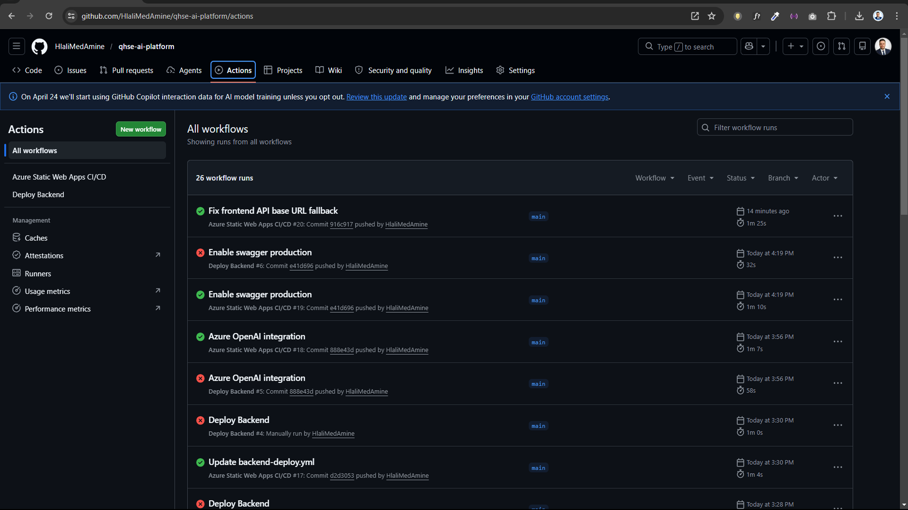

### Déploiement automatique Frontend

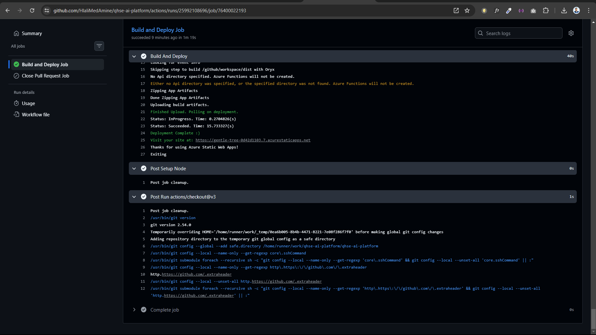

Fonctionnalités du pipeline :

- Build automatique
- Déploiement automatique
- Validation des commits
- Intégration continue
- Livraison continue

---

# 🧩 Implémentation du service IA

Le service IA backend est développé en C# avec Azure OpenAI SDK.

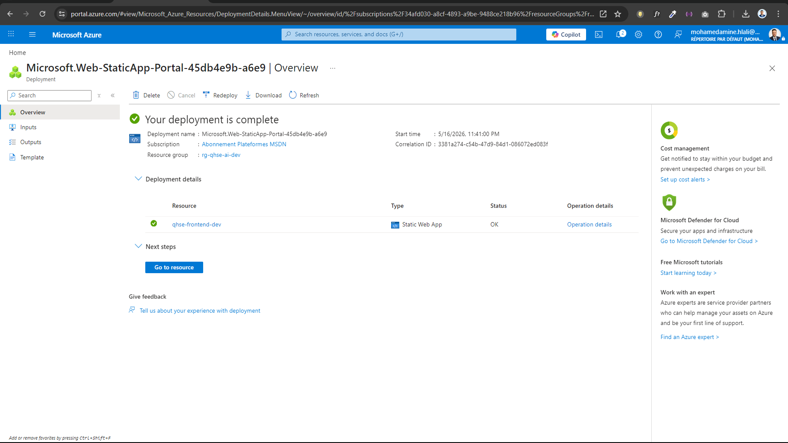

---

# 🧪 Swagger API Testing

L’API REST peut être testée directement via Swagger UI.

### Exemple de requête

Fonctionnalités disponibles :

- Analyse IA
- Gestion des incidents
- Gestion des audits
- Gestion des risques
- Gestion des non-conformités

---

# 📌 Fonctionnalités principales

| Module | Description |
|--------|-------------|
| 🚨 Incidents | Gestion des incidents QHSE |
| 📋 Audits | Gestion des audits |
| ⚠️ Non-conformités | Suivi des non-conformités |
| 📊 Analyse des risques | Classification et évaluation |
| 🤖 Assistant IA | Analyse intelligente via Azure OpenAI |
| 📈 Rapports | Génération de rapports |

---

# 🌍 URLs de production

| Service | URL |
|---------|-----|
| Frontend | https://gentle-tree-0d42d1103.7.azurestaticapps.net |
| Backend API | https://qhse-api-dev-amine.azurewebsites.net |
| Swagger | https://qhse-api-dev-amine.azurewebsites.net/swagger |

---

# 🤖 Exemple de résultat IA

L’assistant IA analyse automatiquement les incidents QHSE et génère :

- Un résumé intelligent
- Un niveau de risque
- Des actions correctives
- Des recommandations préventives

## Exemple réel d’analyse

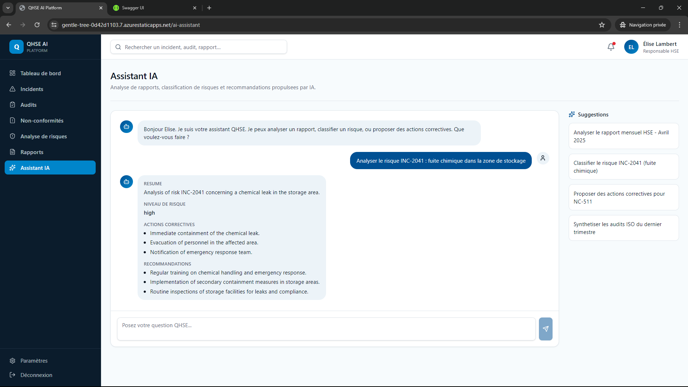

---

# 📊 État actuel du projet

| Composant | Statut |
|-----------|--------|
| Frontend React | ✅ |
| Backend .NET 8 | ✅ |
| Swagger | ✅ |
| Azure OpenAI | ✅ |
| Terraform IaC | ✅ |
| GitHub Actions CI/CD | ✅ |
| Azure App Service | ✅ |
| Azure Static Web Apps | ✅ |

---

# 🎓 Compétences démontrées

- Microsoft Azure
- Azure OpenAI
- ASP.NET Core
- React + TypeScript
- Terraform
- CI/CD
- GitHub Actions
- REST API
- Swagger
- Infrastructure as Code
- Cloud Architecture
- DevOps

---

# 👨‍💻 Auteur

## Mohamed Amine Hlali

Senior Cloud & DevOps Engineer

### Certifications

- AZ-104
- AZ-305
- AZ-400
- Terraform Associate

GitHub : https://github.com/HlaliMedAmine

LinkedIn : https://linkedin.com/in/mohamedaminehlali

---

# 📄 Licence

Projet distribué sous licence MIT.
